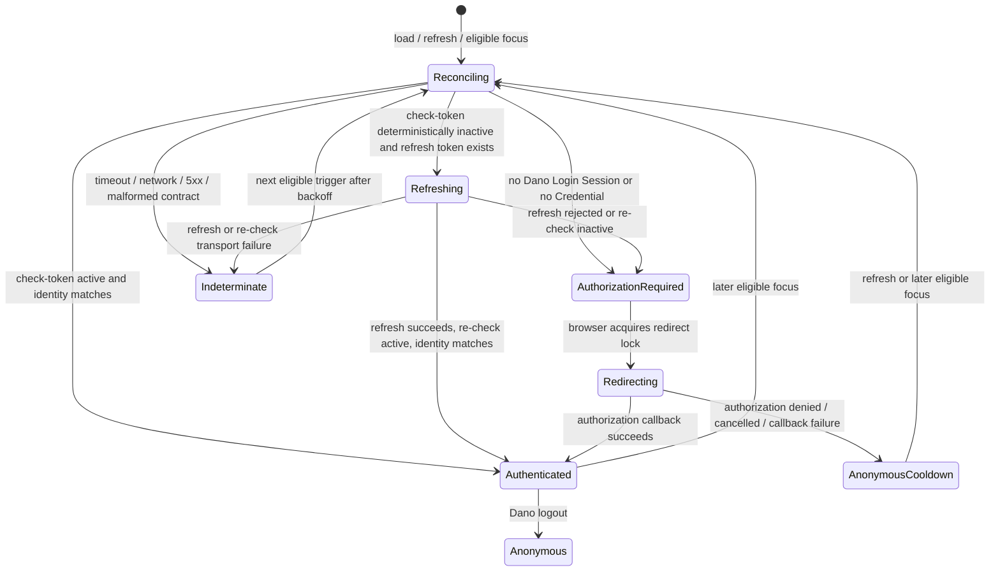

# 第一阶段 Spec：Dano 与 OA 认证状态协调

Status: Proposed

Issue: [#450 OAuth2 登录状态与 OA 双向同步](https://github.com/zhengchengqiaobusiness-arch/Dano/issues/450)

Review PR: [#451](https://github.com/zhengchengqiaobusiness-arch/Dano/pull/451)

Scope: Spec only; no runtime or production change

## 1. 决策摘要

第一阶段实现一个服务端拥有的 **Authentication Reconciliation** module。浏览器只在页面打开、刷新或重新聚焦时请求 Dano 协调认证状态；所有 OA token 校验、刷新、撤销和 Authorization Code 换取都留在 Dano Server。

协调结果只有三类：

1. 当前 Dano Login Session 的 Provider Credential 经 OA `check-token` 验证有效，保持登录；
2. 没有可用 Provider Credential，或凭据经确定性校验和刷新后仍失效，清理当前 Dano Login Session，并要求浏览器以顶层导航进入现有标准 OAuth authorization 流程；
3. OA 网络、超时或响应契约异常，状态不确定，保留当前凭据与会话并等待下一次有界重试，不把基础设施故障解释成用户登出。

本阶段不实现或宣称四向实时单点登出。OA 页面自己的 Bearer Token/Provider Browser Session 与 `danoProduction` 获得的 Provider Credential 不是同一凭据。撤销后者不必然结束 OA 页面会话；OA 页面 logout 也尚未被生产黑盒验证为会撤销 `danoProduction` 的 token。

## 2. 背景与依赖

当前 Dano 已具备：

- `openid-client` 驱动的 Authorization Code、refresh、受保护 identity 请求和 token revocation；
- 浏览器绑定、短时且单次消费的 OAuth `state`；
- 一枚 HttpOnly Dano Cookie 对应一个持久化 Dano Login Session；
- 每个 Dano Login Session 独占一份服务端 AEAD 加密的 Provider Credential；
- `POST /api/auth/logout` 清除当前 Dano Login Session、断开其 Bridge Clients，并尽力撤销该会话的 Provider Credential；
- provider 认证失败后的 `reauth_required` 状态和同一 Login Session 内的 refresh single-flight。

[PR #449](https://github.com/zhengchengqiaobusiness-arch/Dano/pull/449) 已于 2026-08-21 合并，merge commit 为 `f783d267c78aed0a4892870718b807db2af82cc9`。它允许在明确配置下由 Dano Server 访问真实的 HTTP provider token、identity、revocation 和 API 端点，同时保持浏览器 authorization origin 为 OA 真实地址。#449 是生产 OA `check-token` 接入的传输前置条件，但不提供认证协调或 Logout Propagation。

当前缺口是：`GET /api/auth/current` 只读取 Dano 本地会话，不主动验证 Provider Credential；浏览器初始化也会直接建立 Bridge transport。第一阶段必须在使用旧登录状态前经过统一协调 seam。

## 3. 目标与非目标

### 3.1 目标

- 页面打开或刷新时，在 Bridge auto-connect 前协调一次认证状态。
- 页面从后台重新聚焦且满足新鲜度阈值时，再协调一次。
- 已有 Provider Credential 时调用 OA `POST /system/oauth2/check-token`；必要时有界 refresh 并重新校验。
- 没有 Provider Credential 时，不调用 `check-token` 猜测 OA 浏览器状态，而是返回 authorization required，让浏览器顶层导航到现有 `/api/auth/login`。
- OA 已登录且已自动授权 `danoProduction` scope 时，OA 直接返回 Authorization Code，Dano Server 换 token 并建立 Dano Login Session。
- Dano logout 只结束当前 Dano Login Session，并在服务端撤销与其绑定的 access/refresh grant。
- 所有失败状态、重试语义和不可达语义都能从协议测试与浏览器验收中被区分。

### 3.2 非目标

- 不修改 OA、OA 网关或 OA 浏览器 token 存储方式。
- 不轮询 OA authorization 页面，不用 iframe 探测登录，不复制 OA 页面 Bearer Token。
- 不实现本机 relay、SSH tunnel、第三方代理或 Dano 同源浏览器 OAuth 代理。
- 不向浏览器、模型、日志或测试快照暴露 client secret、access token、refresh token、Cookie 或 OA 管理凭据。
- 不承诺 Dano logout 会结束 Provider Browser Session。
- 不承诺 OA logout 会实时通知或结束已有 Dano Login Session。

## 4. 凭据与会话所有权

| 状态或凭据 | 所有者 | 浏览器可见性 | 建立方式 | 终止或消费方式 |
| --- | --- | --- | --- | --- |
| OA Provider Browser Session / OA 页面 Bearer Token | OA 浏览器 origin 与 OA auth backend | 仅 OA origin 可见；Dano 不可读 | OA 自己的登录流程 | OA 页面 logout 或 OA 自己的过期策略 |
| Authorization Code | OA 签发，Dano Server 单次消费 | 仅作为回调 query 短暂经过浏览器 | OA authorization | 成功换取 token、过期或失败后作废 |
| OAuth state / flow binding | Dano Server；绑定发起授权的浏览器 | opaque Cookie/query，不含身份与 token | `/api/auth/login` | 回调时原子消费或 TTL 到期 |
| Dano Login Session | Dano Server | 仅 opaque HttpOnly Cookie | Authorization Code 成功换取并验证 identity | Dano logout、本地 TTL、确定性 provider 失效或已验证的未来 logout 通知 |
| Provider access/refresh token | 单个 Dano Login Session | 永不返回浏览器；服务端 AEAD 加密存储 | Dano Server token exchange/refresh | provider 过期、refresh rotation、Dano logout revocation 或确定性失效清理 |
| Logout Propagation | OA 与 Dano 共同约定的协议 | 取决于未来标准契约 | OIDC/session logout 配置 | 按契约校验和投递；本阶段不存在 |

“该用户对应的 token”在第一阶段严格指当前请求 Cookie 所定位的 Dano Login Session 所拥有的 Provider Credential。Dano 不按 User 全局寻找或共享 token；同一 User 的其他 Login Session 不受本次协调或 logout 影响。

## 5. Module 与 seam

### 5.1 Authentication Reconciliation module

浏览器与 Dano Server 之间只增加一个小 Interface：

```http
POST /api/auth/reconcile
Origin: https://<dano-origin>
Content-Type: application/json
Cookie: dano_login=<opaque>

{
  "trigger": "load" | "focus",
  "returnTo": "/current/path?query#fragment"
}
```

约束：

- 仅接受与 Dano `appOrigin` 相同的 `Origin`；缺失或跨 origin 返回 `403`。
- `returnTo` 复用现有 same-origin relative-path 校验，不能携带 origin、credentials 或开放重定向。
- 响应始终 `Cache-Control: no-store`，不返回 provider URL、token、client identifier 或秘密。
- endpoint 可以删除失效 Dano Login Session、刷新加密 Provider Credential，因此必须使用 `POST`，不能伪装成只读 `GET`。
- 浏览器通过 `credentials: "same-origin"` 调用；服务端只信任 Cookie 定位的 Login Session。

成功与失败响应为封闭 union：

```ts
type AuthenticationReconciliationResult =
  | {
      status: "authenticated";
      user: BrowserUserSummary;
      checkedAt: number;
    }
  | {
      status: "authorization_required";
      loginPath: string; // 仅 Dano 同源 /api/auth/login?... 路径
      reason: "missing_session" | "missing_credential" | "credential_inactive";
    }
  | {
      status: "indeterminate";
      retryAfterMs: number;
      reason: "provider_unavailable" | "provider_contract_error";
    };
```

HTTP status：

- `200`：`authenticated` 或 `authorization_required`；两者都是已完成的确定性协调结果。
- `400`：trigger/returnTo 非法。
- `403`：Origin 非法。
- `503`：`indeterminate`。浏览器保留当前展示，不自动 logout，不立即跳转 authorization。

`GET /api/auth/current` 保留为本地状态投影，不调用 OA。第一阶段实现后，浏览器启动顺序改为先 reconcile，再以结果启动 authenticated 或 Anonymous transport；其他调用者仍可用 `/api/auth/current` 获取纯本地状态。

### 5.2 OAuth Provider Adapter 内部 seam

现有 `OAuthProviderAdapter` 增加服务端内部能力，不把 OA 私有响应泄露到上层：

```ts
checkCredential(
  credential: ProviderCredential,
): Promise<
  | { status: "active"; identity: ExternalIdentity }
  | { status: "inactive" }
>;
```

OA adapter 固定使用：

- `POST {DANO_OAUTH_CHECK_TOKEN_ENDPOINT}`；
- `application/x-www-form-urlencoded` body 中传 `token`；
- 与生产现状相符的 `client_secret_basic`；
- 现有 server-side provider headers、timeout、受控 HTTP opt-in 和 `redirect: "error"` 规则；
- 将 OA `CommonResult` envelope 归一化，只向协调 module 返回 `active/inactive/contract error`。

OA 上游实现的 `check-token` 同时返回 token 所属 user/client 信息。adapter 必须解析稳定 External Identity，并由协调 module 与 Dano Login Session 的 User 做恒定比较；identity 不匹配属于 provider contract/security failure，不可把会话迁移给另一个 User。

## 6. 状态机



确定性失效只包括：OA 明确报告 token 不存在/过期、refresh 明确返回 invalid grant，或 refresh 后重新 check 仍 inactive。网络错误、超时、OA 5xx、非预期 HTML/JSON 和无法解析的 envelope 都属于 `indeterminate`。

## 7. 协调算法

1. 读取当前 Cookie 对应的 Dano Login Session，不触碰其他同 User 会话。
2. 无会话：返回 `authorization_required/missing_session`；不得调用 `check-token`。
3. 会话是 `reauth_required` 或缺少可解密 Credential：原子删除该会话并返回 `authorization_required/missing_credential`。
4. 对 access token 调用 `checkCredential`。
5. active 且 External Identity 与会话 User 相同：touch 本地 session，返回 `authenticated`。
6. active 但 identity 不同：按安全故障处理，清除当前 Login Session、尽力撤销其 Credential、断开该会话的 Bridge Clients，并返回 `authorization_required/credential_inactive`；记录不含用户标识和 token 的结构化错误计数。
7. inactive 且有 refresh token：进入该 Login Session 的 refresh single-flight；成功后必须再次 `checkCredential` 并再次比较 identity，只有两者都通过才原子替换加密 Credential。
8. inactive 且无 refresh token，或 refresh 被 provider 确定性拒绝：原子删除当前 Login Session，尽力撤销旧 Credential，断开对应 Bridge Clients，清除 login Cookie，返回 `authorization_required/credential_inactive`。
9. 任一步发生传输或契约不确定错误：不删除、不 touch 成“已验证”、不重定向，返回 `503 indeterminate`。下一次 eligible trigger 才重试。

先 refresh 后 reauthorize 的目的不是延长已被明确撤销的授权，而是处理正常 access-token expiry。refresh 后必须重新 check，不能仅因 token endpoint 返回 200 就宣称会话有效。

## 8. Authorization Code 时序

```mermaid
sequenceDiagram
    participant B as Browser
    participant D as Dano Server
    participant O as OA

    B->>D: POST /api/auth/reconcile (load/focus)
    alt current Dano Login Session has Credential
        D->>O: POST /admin-api/system/oauth2/check-token (Basic + server-held token)
        O-->>D: active / inactive / error
    end
    alt active
        D-->>B: authenticated
    else missing or deterministically inactive
        D-->>B: authorization_required + same-origin loginPath
        B->>D: top-level GET /api/auth/login
        D-->>B: 303 to real OA authorization origin
        B->>O: GET http://admin.dianshixinxi.com:90/sso?...state...
        O-->>B: login/consent or authorization code redirect
        B->>D: GET /api/auth/callback?code=...&state=...
        D->>O: POST token endpoint using client_secret_basic
        O-->>D: access/refresh token
        D->>O: identity request
        D-->>B: Set-Cookie opaque Dano Login Session; 303 returnTo
    else provider indeterminate
        D-->>B: 503 indeterminate + retryAfterMs
    end
```

若 OA Provider Browser Session 有效且 scope 已自动批准，OA 可以直接返回 Authorization Code；这就是本阶段“OA 已登录时打开 Dano 自动登录”的可达语义。它仍是一次真实的顶层 authorization navigation，不是 `check-token` 查询 OA 浏览器登录状态。

## 9. 触发时机与防重入

### 9.1 触发

- **打开/刷新**：每个 document boot 恰好协调一次，并阻止 Bridge auto-connect 使用未经本次校验的 authenticated 状态。
- **重新聚焦**：监听 `visibilitychange`；仅在 `document.visibilityState === "visible"`、距离上次完成协调超过新鲜度阈值且当前没有 in-flight 请求时触发。
- **window focus**：只作为 visibility API 不可用时的 fallback；同一可见性变化不能触发两次。
- **不轮询**：没有 interval、隐藏页面后台请求或 authorization iframe。

### 9.2 防重入和 redirect loop

- 浏览器内只有一个 reconciliation Promise；并发 load/focus 复用它。
- 服务端按 Login Session 对 check/refresh single-flight，同一 session 的 focus storm 只产生一个 provider 操作链。
- 浏览器收到 `authorization_required` 后先取得每 tab 的 sessionStorage redirect lock，再 `window.location.assign(loginPath)`；lock 只保存时间与尝试类别，不保存 token、身份或 URL query。
- callback 成功清除 lock。callback denial/error 返回 Dano 后进入自动授权 cooldown；该 document 不立即再次跳 OA。
- `loginError`、OAuth error callback、超过 pending transaction 上限或刚从 OA `/login` 返回都必须抑制即时重定向。用户显式点击“登录/重新登录”可以绕过自动 cooldown。
- focus retry 使用服务端 `retryAfterMs` 与有界指数退避；刷新页面代表一次新的显式协调机会，但仍受服务端 pending transaction 上限保护。

## 10. Dano logout 契约

继续使用现有：

```http
POST /api/auth/logout
Origin: https://<dano-origin>
Cookie: dano_login=<opaque>
```

服务端必须按以下顺序完成：

1. 校验 same-origin `Origin`；
2. 原子摘除当前 Dano Login Session，使后续请求不能再取得 Credential；
3. 断开只属于该 Login Session 的 Bridge Clients；
4. 在服务端尽力撤销该 Login Session 的 OAuth access token/grant；OA 当前删除 token 的实现会连带删除对应 refresh token；
5. 无论 provider revocation 成功、失败或超时，都清除 Dano HttpOnly Cookie 并返回 `{ "status": "anonymous" }`。

浏览器不直接调用 OA token、check-token 或 auth logout endpoint。Dano logout 不导航到 OA，不读取 OA 页面 Bearer Token，也不声称 OA 页面已经退出。

## 11. 安全边界

- **CSRF**：`reconcile` 与 `logout` 都是有副作用的 POST，必须校验 exact app Origin；OAuth callback 继续依赖一次性 state 与 browser flow binding。
- **state**：至少 256-bit 等价随机 opaque value、短 TTL、原子单次消费、绑定发起浏览器和固定 returnTo；回调错误也消费 transaction。
- **PKCE**：当前已验证 OA contract 会忽略 PKCE，ADR 0006 因此不发送 verifier/challenge，也不把 PKCE 写成现有安全控制。若 OA 以后正式支持 S256，应在 OAuth Provider Adapter 内增加并做协议测试，不改变浏览器秘密边界。
- **client secret**：只存在于部署管理和 Dano Server 内存；用 `client_secret_basic` 调用 token/check/revocation，不进入浏览器 bundle、response、日志或 query。
- **provider token**：只存在于 Dano Server，持久化时 AEAD 加密并绑定 Login Session；不能进入浏览器、模型、SSE、错误消息或 metrics label。
- **日志**：只记录结果类别、延迟、HTTP 类别和匿名计数；不得记录 callback query、Cookie、token、Basic header、External Identity 原值或 OA 响应 body。
- **same-origin**：浏览器只接触 Dano `/api/auth/*` 和顶层 OA authorization navigation；没有浏览器 OAuth proxy。

## 12. 失败与网络异常

| 情况 | 分类 | Dano 状态 | 浏览器行为 |
| --- | --- | --- | --- |
| check-token 明确 active 且 identity 匹配 | 确定有效 | 保持并 touch session | 保持登录，启动/保持 transport |
| check-token 明确 token 不存在或过期 | 确定失效 | 有 refresh 则单次 refresh；否则清理 | 最终进入 authorization |
| refresh invalid grant / refresh 后仍 inactive | 确定失效 | 清理 session 与 Credential | 顶层 authorization |
| check/refresh timeout、DNS、连接失败、HTTP 5xx | 不确定 | 保留原状态，不写“已验证”时间 | 显示现状，退避到下次 trigger |
| HTTP 200 但 OA envelope/identity 不符合契约 | 不确定且可观测 | 保留 session；不迁移 User | 不自动 logout/redirect；报告通用暂不可用 |
| identity 与 Dano User 不同 | 安全故障 | 清理当前 session，尽力 revoke | authorization required |
| callback state 无效、重复或过期 | 拒绝 | 不建立 session | 返回安全路径并显示通用登录失败 |
| authorization 用户取消/拒绝 | 用户终止 | Anonymous / 原 session 已失效 | cooldown，禁止立即循环跳转 |
| logout revocation 失败 | 本地 logout 成功 | session 已删除 | 返回 Anonymous；metrics 记录失败类别 |

本阶段不缓存“active”结论跨越下一次 eligible trigger。可以在同一 focus storm 内 single-flight，但不能用长 TTL 避开用户明确要求的打开/刷新/聚焦校验。

## 13. 可达与不可达语义

| 方向 | 第一阶段语义 | 承诺级别 |
| --- | --- | --- |
| OA 已登录 → 打开 Dano | Dano 顶层发起 authorization；OA 若保留浏览器会话且自动批准 scope，则直接回 code，Dano 建立 Login Session | 可达，需真实浏览器验收 |
| Dano 登录 → OA | 登录流程访问 OA 真实 origin，因此 OA 可在自身规则下建立/复用 Provider Browser Session | 可达，但 OA 会话仍由 OA 定义 |
| Dano logout → OA | 删除 Dano Login Session，并撤销该会话的 Provider Credential | 仅 token/logout 本地语义；不承诺 OA 页面退出 |
| OA logout → 已有 Dano | 下一次打开/刷新/eligible focus 调用 check-token；只有 OA logout 确实撤销 `danoProduction` token 时才会被发现 | 条件可达；当前不得宣称已同步 |
| OA logout → Dano 实时退出 | OA 主动通知并定位 Dano Login Session | 不可达；无 front/back-channel logout |
| Dano logout → OA 浏览器实时退出 | Dano 调用 OA end-session/browser logout | 不可达；无已验证 RP-Initiated Logout 契约 |

当前公开 Yudao 实现的 OA 页面 `POST /system/auth/logout` 只删除请求携带的 OA 页面 Bearer Token；它不按 User 撤销其他 OAuth client grant。因此公开实现预期不会使 `danoProduction` token 的 check-token 失效。生产可能是私有 fork，仍必须完成第 15 节的黑盒验收；在证据出现前，产品文案和 issue 结论只能写“下次协调会检查 Provider Credential”，不能写“OA logout 已同步到 Dano”。

## 14. 协议级测试计划

### 14.1 OAuth Provider Adapter

- check-token 使用 POST、form `token`、标准 `client_secret_basic` 和固定 provider headers。
- OA `{code: 0, data: ...}` active envelope 正确归一化并输出 External Identity。
- HTTP/envelope 401、token missing/expired 归类 inactive。
- timeout、5xx、HTML、malformed JSON、缺字段归类 contract/transport error，不归类 inactive。
- URL、redirect、HTTP opt-in、timeout 与 secret/token redaction 继承现有 adapter 安全断言。

### 14.2 Authentication Reconciliation HTTP

- 无 Cookie/无 session/无 Credential：不调用 check-token，返回 same-origin `loginPath`。
- active：保持同一 Login Session 和 Credential；不会创建新 session。
- expired access + refresh success + re-check active：原子 rotation，保持 session ID。
- refresh invalid / re-check inactive：删除当前 session、清 Cookie、只断开当前 session Clients。
- identity mismatch：fail closed，不把当前 User 替换成 provider 返回的 User。
- network/5xx/malformed：503 indeterminate，session 文件和 encrypted Credential 保持不变。
- 同一 session 并发 reconcile：一次 check/refresh chain；不同 session 相互隔离。
- same-User 多 session：只协调 Cookie 指定的 session，不共享或撤销 peer Credential。
- invalid Origin/returnTo：403/400，provider 零调用。
- callback、logout 与 reconcile race：不会复活已摘除 session，不会把旧 Credential 覆盖到新 session。

### 14.3 Browser store

- boot reconciliation 完成前不以旧 authenticated 状态 auto-connect。
- visible focus 满足阈值才触发；hidden、重复 focus 和 in-flight focus 不触发。
- authorization_required 只产生一次顶层 navigation。
- callback error/loginError 进入 cooldown，不形成 OA ↔ Dano redirect loop。
- indeterminate 不改成 Anonymous，不立即 authorization，并按 retryAfterMs 退避。
- 显式登录继续使用现有 `/api/auth/login`，不受自动 cooldown 永久阻断。

## 15. Codex 内置浏览器验收矩阵

最终验收必须使用 Codex 内置浏览器；curl/API 只能作为辅助协议证据，不能替代以下流程。

| 编号 | 前置状态 | 操作 | 预期证据 |
| --- | --- | --- | --- |
| B1 | OA 已登录，Dano 无 Login Session | 新开 Dano | 自动顶层进入 OA authorization，无再次输入凭据，回 Dano 显示同一 OA User |
| B2 | OA 已登录，Dano 已登录且 token active | 刷新 Dano | check 成功、无 authorization 跳转、会话与页面可用 |
| B3 | 同 B2 | 切到其他页超过阈值后聚焦 Dano | 只协调一次，无 focus storm 或重复跳转 |
| B4 | Dano token 被 OA 明确撤销，OA 浏览器仍登录 | 刷新/聚焦 Dano | Dano 清理旧 session，authorization 自动回 code 并建立新 session |
| B5 | OA 与 Dano 都已登录 | 在 OA 页面 logout，再回 Dano 聚焦 | 联合记录 OA 页面回 `/login` 与 Dano reconcile 结果；若 check 仍 active，明确判定“OA logout 不传播” |
| B6 | OA 未登录，Dano 无 session | 打开 Dano | 顶层到 OA login；取消/返回后不发生 redirect loop，显式登录仍可用 |
| B7 | Dano 与 OA 都已登录 | Dano logout | Dano 变 Anonymous，旧 Dano session 不能复用；OA 页面是否仍登录被单独记录，不能据此改变声明 |
| B8 | Dano 已登录 | 在测试环境让 check-token timeout/5xx | Dano 不误删 session、不跳 OA；页面给出非敏感暂不可用状态，后续聚焦可恢复 |
| B9 | 同一 User 两个独立 Dano Login Session | 仅一个窗口 logout 或 token 失效 | 只影响目标 session，另一个窗口继续有效 |

B5 是“OA logout → Dano 有限同步”声明的发布门槛。只有生产等价 OA 明确使 `danoProduction` token inactive，且 Dano 在下一次规定 trigger 清理 session，才能在发布文档中声称有限同步；否则必须保留“不传播”的结论。

验收记录只保存页面 URL、可见身份文案、状态类别、时间和无敏感值的服务端计数；不得截图或导出 token、Cookie、Authorization header、OA 管理配置秘密。

## 16. 部署配置、上线门槛与回滚

### 16.1 新配置

第一阶段实现预计只增加：

```text
DANO_OAUTH_CHECK_TOKEN_ENDPOINT=http://h5.dianshixinxi.com:90/admin-api/system/oauth2/check-token
```

该 endpoint：

- 仅由 Dano Server 访问；
- 必须与 issuer/token/identity/revocation 一样经过生产配置校验；
- 生产 HTTP 访问依赖 #449 的 `DANO_OAUTH_ALLOW_INSECURE_SERVER_ENDPOINTS=true` 明确 opt-in；
- 继续使用真实浏览器 authorization origin `http://admin.dianshixinxi.com:90/sso`；
- 继续使用 `danoProduction` 与 `client_secret_basic`；secret 只由部署 secret 管理提供。

未配置 check-token endpoint 时，Production Authentication Gate 必须拒绝启用第一阶段自动协调；不能静默退回 identity endpoint 并宣称已实现本 Spec。

### 16.2 部署前置条件

- Spec 评审通过后另开或更新 implementation PR，并按运行时变更提升 root patch version。
- 所有第 14 节测试通过，`pnpm run check`、`pnpm test`、`pnpm run build` 通过。
- 在非生产或生产等价环境完成 B1-B9；生产最终验收仍需另行明确部署授权。
- 确认 OA OAuth client redirect URI、scope auto-approve 和 token/check/revocation contract 未漂移。
- 确认 nginx 继续转发 Dano `/api/auth/*` Cookie/Origin，callback query 不记录日志。
- 对 B5 给出“token inactive”或“token remains active”的明确证据，并据此收窄发布声明。

### 16.3 回滚条件

出现以下任一情况立即回滚 Dano release/配置，不修改 OA：

- load/focus 产生重复 OA 跳转或用户取消后 redirect loop；
- OA 网络故障导致 Dano 批量清除 Login Session；
- identity mismatch、same-User 多 session 或 callback/logout race 破坏隔离；
- check-token 请求离开 server-side seam，或任何 secret/token 出现在浏览器、日志、SSE 或 snapshot；
- OA authorization origin 被改写为 Dano origin、h5 origin、relay 或代理；
- 真实内置浏览器验收不能区分 Provider Browser Session 与 Provider Credential。

回滚恢复到 #449 后的既有行为：Dano 仅在显式登录时发起 authorization，现有 Dano logout 继续清理本地 session 并尽力撤销 Provider Credential。回滚不恢复已撤销 token，也不操作 OA 页面会话。

## 17. 评审与实施拆分

本 PR 只提交本 Spec、既有所有权 ADR/部署边界和调查证据，不修改 runtime。评审通过后的 implementation PR 应以 Authentication Reconciliation module 的 Interface 为测试 surface，集中修改 provider adapter、OAuth authentication lifecycle、browser store、配置解析和对应测试；不要在多个页面调用点复制 check/refresh/redirect 决策。

实施完成不等于生产部署。本 issue 明确不授权生产变更。

## 18. 证据

- [OA OAuth2 logout contract research](../research/oa-oauth2-logout-contract.md)
- [ADR 0006: Use openid-client for the OAuth confidential client](../adr/0006-use-openid-client-for-oauth-confidential-client.md)
- [ADR 0007: Do not equate OAuth token revocation with browser session logout](../adr/0007-do-not-equate-oauth-token-revocation-with-browser-session-logout.md)
- [Yudao OAuth2OpenController](https://github.com/YunaiV/ruoyi-vue-pro/blob/2bbe79b34ab8c9c7b0148300599dc8d4881c8db1/yudao-module-system/src/main/java/cn/iocoder/yudao/module/system/controller/admin/oauth2/OAuth2OpenController.java)
- [RFC 6749 OAuth 2.0](https://www.rfc-editor.org/rfc/rfc6749.html)
- [RFC 7009 Token Revocation](https://www.rfc-editor.org/rfc/rfc7009.html)
- [RFC 7662 Token Introspection](https://www.rfc-editor.org/rfc/rfc7662.html)
- [OpenID Connect RP-Initiated Logout 1.0](https://openid.net/specs/openid-connect-rpinitiated-1_0.html)
